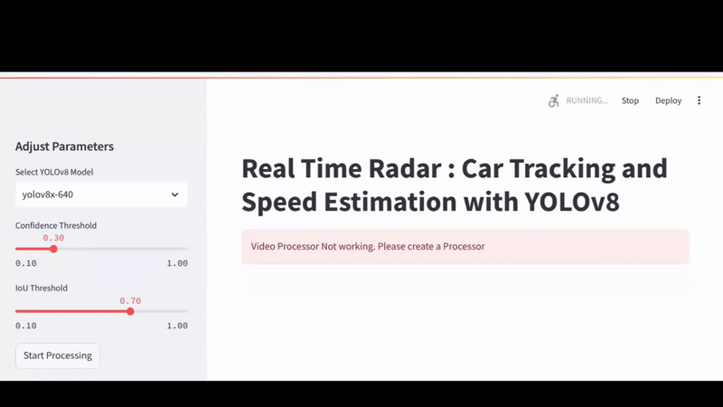
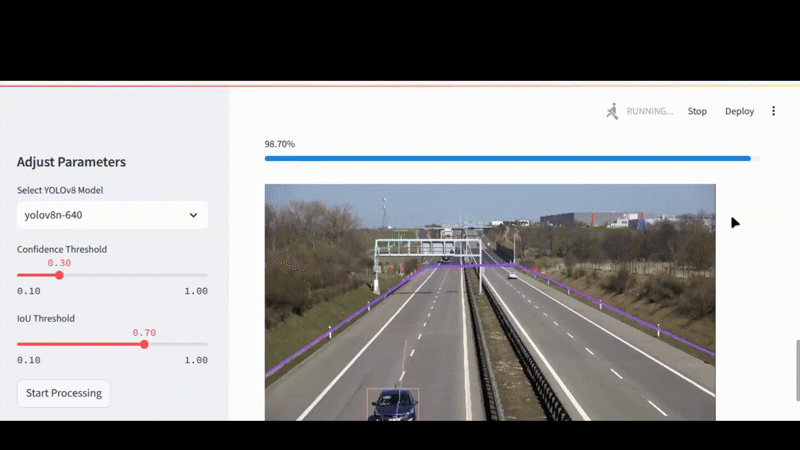
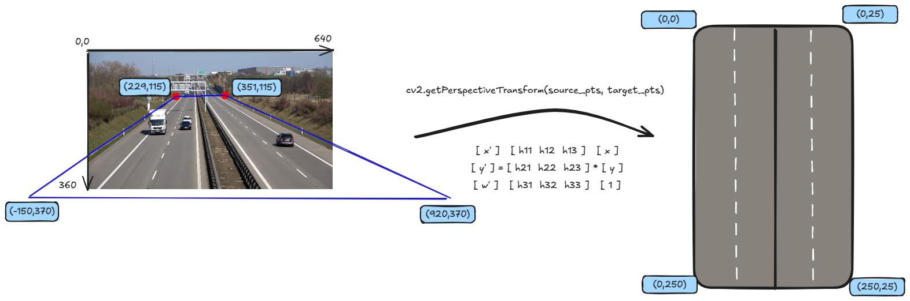

# Live Video Streaming & Processing

## Overview

This project enables real-time streaming, processing, and annotation of live video feeds from YouTube. The system extracts video metadata, captures frames, and applies object detection and tracking, with optional speed estimation.

## Features

- **Live Video Streaming:** Uses yt-dlp and OpenCV to fetch and process video streams even from live youtube streams.
- **Frame Processing:** Captures frames in real-time, detects objects, and applies annotations.
- **Object Tracking & Speed Estimation:** Utilizes ByteTrack for multi-object tracking and estimates speed using homography transformations.
- **Queue-Based Frame Management:** Ensures smooth processing with thread-safe queue handling.
- **Preview and Source Points Selection:** Guides the user to choose the space where the detection will take place.
- **Robust Failure Handling:** Implements retry mechanisms for stream stability.
- **Web Interface:** Provides a real-time dashboard for video visualization and monitoring.
- **Command-Line Interface (CLI):** Enables control of the streaming and processing pipeline through terminal commands.

## Installation

### Prerequisites

Ensure you have the following installed:

- Python 3.8+
- yt-dlp for YouTube video extraction
- OpenCV for image processing
- supervision for annotation and tracking
- numpy for numerical operations
- Streamlit for web interface (optional)

### Install Dependencies

```bash
pip install -r "requirements.txt"
```
## Demo
### Video Selection and Processor creation


### Preparing Source Poitns And Target For Homography Transformations.


### Video Process And Speed Estimation


### Download Video Once Process is Complete



## Explanation
- The **left image** represents a real-world road scene with a camera capturing at an angle.
- The **center matrix** applies a transformation using OpenCV.
- The **right image** shows the **top-down view**, which is useful for radar-based vehicle tracking.



## Usage

### Extract Video Stream Information

```python
from live_capturing import get_stream_infos

info = get_stream_infos("https://www.youtube.com/watch?v=example")
print(info)
```

### Start Live Capture

```python
from live_capturing import LiveCapture

stream = LiveCapture("https://www.youtube.com/watch?v=example").start()
```

### Process Video with Object Detection

```python
from process_video import process_video

process_video(
    type="live",
    input="https://www.youtube.com/watch?v=example",
    model="yolov8n-640",
    iou=0.3,
    confidence=0.3,
    display=True
)
```

## Web Interface

The system includes a web-based dashboard for monitoring and controlling live streams. It allows the user to create a VideoProcessor and choose video source , the target and the source infos and then process the file .

### Features
- **Dynamically change the processor parameters**
- **Dynamically select the source points by clicking on the image**
- **Process a video and download it once finished**


To start the web interface, run:

```bash
streamlit run app.py
```

Then access the dashboard at `http://localhost:8501`.

## Line Commands

You can use the Commands to manage streams and process the videos. 

### Available Commands:

- **Video Previewing:**
It provides a command-line interface for video frame processing. The
    available modes are 'preview' and 'test_source'. 
    - The 'preview' mode displays a
    single frame from the given video source (local or live). 
    - The 'test_source'
    mode displays a frame with the source points drawn as circles and a connecting
    polygon.
    ```
    python preview.py preview --url ./data/vehicles.mp4
    python preview.py test_source --url ./data/vehicles.mp4 --source 229 115 351 115 920 370 -150 370
    ```

- **Video Processing:**
    Process a video (local or live) using the specified parameters.
    Args:
    - type (str, mandatory): Type of video, either 'local' or 'live'.
    - input (str, mandatory): Path to the video file (for local) or YouTube URL (for live).
    - output (str, optional): Path to save the output video. Defaults to None.
    - source (list, optional): Source polygon coordinates. Defaults to None.
    - target (list, optional): Target polygon coordinates. Defaults to None.
    - model (str, optional): Model type for inference. Defaults to "yolov8x-640".
    - iou (float, optional): IoU threshold for detection. Defaults to 0.3.
    - confidence (float, optional): Confidence threshold for detection. Defaults to 0.3.
    - display (bool, optional): Whether to display the video during processing. Defaults to False.

    ```
    #Local Video Example
      python main.py local  './data/vehicles.mp4' --output './data/result.mp4'  --iou 0.7 --confidence=0.3 --source 229 115 351 115 920 370 -150 370 --target 0 0 24 0 24 249 0 249 --display
    #Real Time Live Video
      python main.py live  'https://www.youtube.com/watch?v=5_XSYlAfJZM)' --output './data/result.mp4' --display
    ```

## Architecture

- **Stream Extraction:** Uses yt-dlp to fetch live video URLs.
- **Frame Capture:** Uses cv2.VideoCapture to extract frames from the stream.
- **Processing Pipeline:**
  - Object detection via YOLOv8.
  - Non-Maximum Suppression (NMS) for overlapping detections.
  - Object tracking using ByteTrack.
  - Speed estimation using homography transformation.
- **Queue-Based Streaming:** Frames are added to a queue for sequential processing.

## Configuration

You can configure key parameters in `video_processor.py`:

```python
confidence = 0.3  # Minimum confidence threshold for object detection
iou_threshold = 0.3  # Intersection over Union threshold for merging detections
model_path = "yolov8n-640"  # Model Type for the detections
```

## Error Handling

- If a stream fails, the system retries up to `max_failures` times.
- If buffering is full, old frames are dropped to maintain real-time processing.

## Future Enhancements

- **Multi-Stream Processing:** Support for multiple live streams simultaneously.
- **Edge Deployment:** Optimize for deployment on edge devices.
- **Enhanced Web Interface:** Additional real-time statistics and user controls.

## License

MIT License


